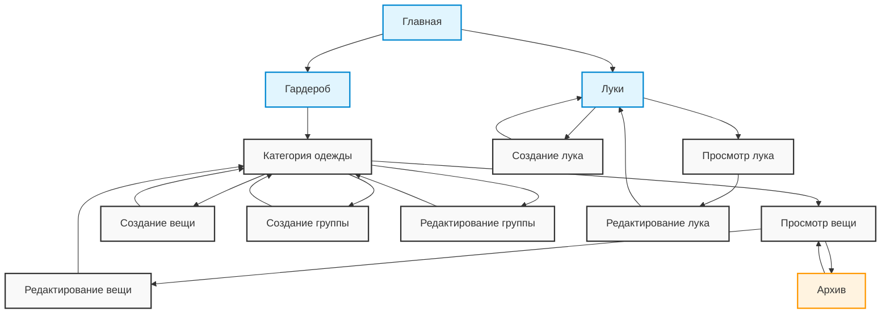

## Описание переходов

### Основные разделы

- **Главная** → **Гардероб** / **Луки**
  - Основная навигация по разделам приложения

### Гардероб

- **Категория одежды**
  - Просмотр списка вещей в категории
  - Управление группами вещей
  - Добавление новых вещей
- **Вещь**
  - Просмотр детальной информации
  - Редактирование характеристик
  - Архивация/восстановление

### Управление группами

- Создание новых групп
- Редактирование существующих групп
- Удаление групп

### Луки

- Просмотр списка луков
- Создание новых луков
- Редактирование существующих луков

### Архив

- Доступ к архивированным вещам
- Возможность восстановления вещей

## Особенности навигации

- Все изменения (создание, редактирование) возвращают пользователя к списку
- Архивация доступна только из режима просмотра вещи
- Группы управляются только из категории
